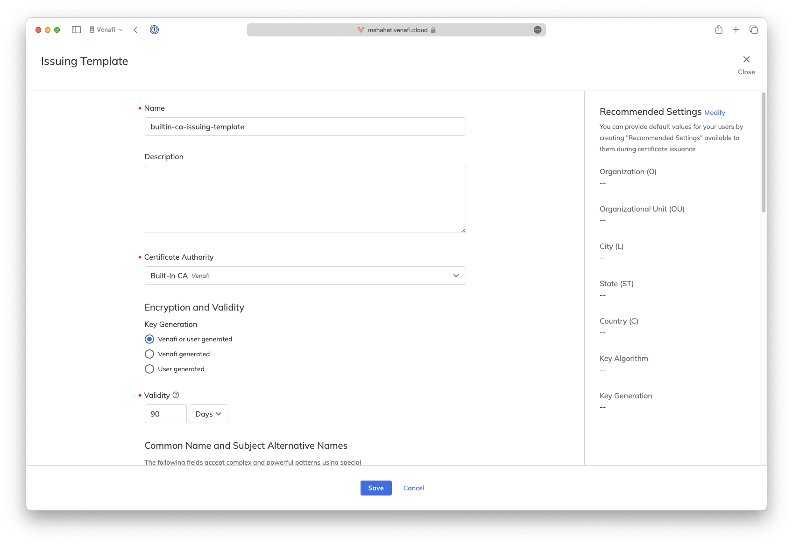

TLS Protect for Kubernetes Playground

Review the prerequisites listed in the [Home Page](../README.md)

Step x Prepare a team, an issuing template policy and an application

login to your tenant https://<tenant>.venafi.cloud or https://<tenant>.venafi.eu if you use an EU tenant.
For the rest of this worksho, we will only using venafi.cloud, please remember to use .eu if you are using an EU tenant

  

Go to Settings > Teams > New

  

Enter the team name e.g. `sys-admin-team`

Choose the owner user for this team. Choose other members if applicable. 

Choose the role e.g. `System Administrator`

  

Go to Policies > Issuing Templates > New

  

Type the Issuing Template name e.g. `builtin-ca-issuing-template`

Choose the Certificate Authority for this template

For this workshop we will use the Venafi Built in CA that comes ready to use with VaaS

  

For Key Generation choose Venafi or user generated

Change the validity for issued certificates. The default is 90 days

  

Scroll to the end of the page and choose Allow everyone to consume

  

Now the timem comes to create an Application
Go to Applications > New

  

  

  

  

  

  

  

