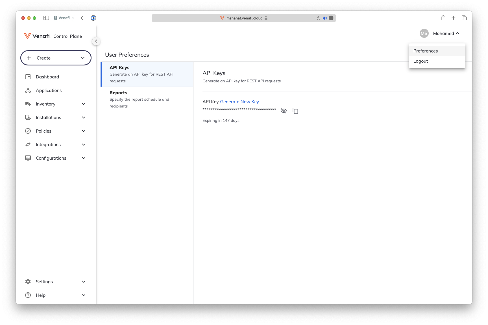

# Create a Cert Manager Issuer

At this stage you should have already configured Venafi Control Plane, created or have access to a kubernetes cluster and have deployed cert manager and other components using `venctl`

In this part of the workshop, you will create a cert manager cluster issuer based on the Venafi Enhanced Issuer
You will create the following 

- venafi cloud credential
- venafi cloud connection
- venafi issuer

## Create Venafi Control Plane API Key secret file

Find and take a note of your VaaS API Key

<p align="center">
  
</p>

Create file `venafi-cloud-credentials.yaml` under folder `venafi-install`. Replace `YOUR-VAAS-API-KEY-HERE` with your api key

```yaml
apiVersion: v1
kind: Secret
metadata:
  name: venafi-cloud-credentials
  namespace: venafi
stringData:
  venafi-cloud-key: YOUR-VAAS-API-KEY-HERE
```

## Create a VenafiConnection to Venafi Control Plane file

Create `venafi-cloud-connection.yaml`  under folder `venafi-install`

```yaml
apiVersion: jetstack.io/v1alpha1
kind: VenafiConnection
metadata:
  name: venafi-connection
  namespace: venafi
spec:
  vaas:
#    url: https://venafi.example.com/vedsdk
    apiKey:
    - secret:
        name: venafi-cloud-credentials
        fields: ["venafi-cloud-key"]
```

## RBAC and Cert Policy files

The following RBAC rules are required for the components to acquire the needed access. Also Certificate policy for automatic approvals

Find `venafi-connection-rbac.yaml` under folder `venafi-install`. This is already created

Find `cert-policy-and-rbac.yaml` under folder `venafi-install`. This is already created

## Create a Venafi cluster issuer file

Create `venafi-cloud-privateca-cluster-issuer.yaml` under folder `venafi-install`

Observe spec.zone `zone: "app-a-builtin\\builtin-ca-issuing-template" ` it's a combination of the application name and the issuing template. Please update if you have created differnet application or issuing policy name.

Also note that this is a Venafi Enhanced Issuer

```yaml
apiVersion: jetstack.io/v1alpha1
kind: VenafiClusterIssuer
metadata:
  name: venafi-privateca-cluster-issuer
spec:
  venafiConnectionName: venafi-connection
  zone: "app-a-builtin\\builtin-ca-issuing-template" 
```

## Apply manifests to the Kubernetes cluster

```bash
kubectl -n venafi apply -f venafi-install/cert-policy-and-rbac.yaml
kubectl -n venafi apply -f venafi-install/venafi-connection-rbac.yaml
kubectl -n venafi apply -f venafi-install/venafi-cloud-credentials.yaml
kubectl -n venafi apply -f venafi-install/venafi-cloud-connection.yaml 
kubectl -n venafi apply -f venafi-install/venafi-cloud-privateca-cluster-issuer.yaml
```

Check if the clusterissuer is Ready

```
$ kubectl get venaficlusterissuers.jetstack.io venafi-privateca-cluster-issuer 

NAME                              READY   REASON    MESSAGE                         LASTTRANSITION   OBSERVEDGENERATION   GENERATION   AGE
venafi-privateca-cluster-issuer   True    Checked   Succeeded checking the issuer   114s             1                    1            115s
```


[Main Menu](../README.md) | Next [Issue Certificates in Kubernetes](README4.md)