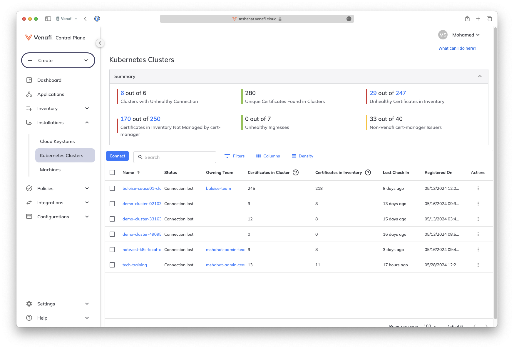
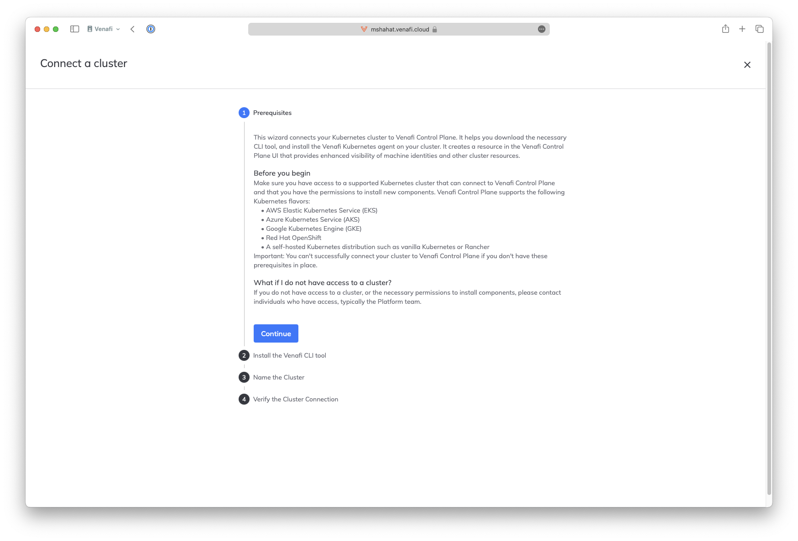
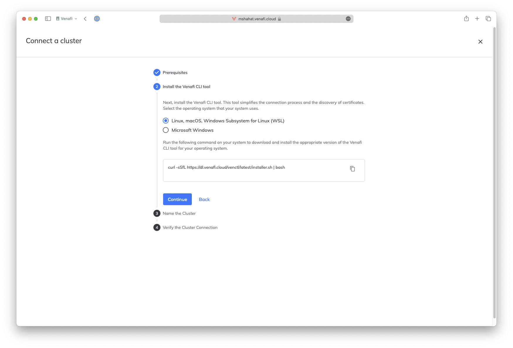
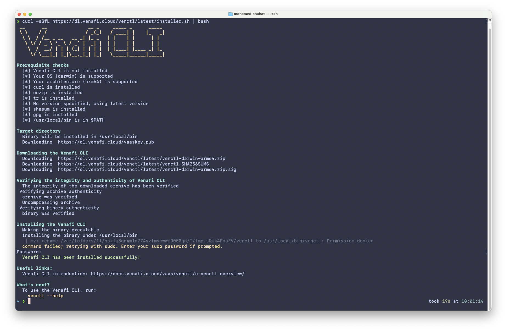
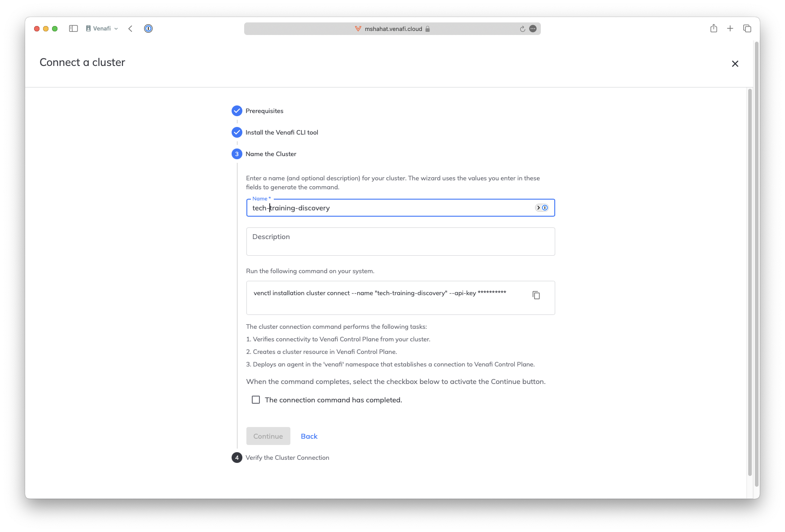
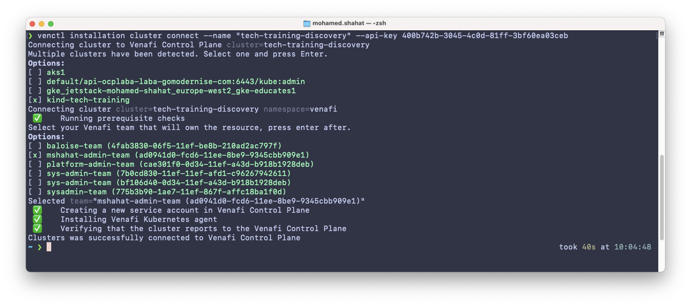
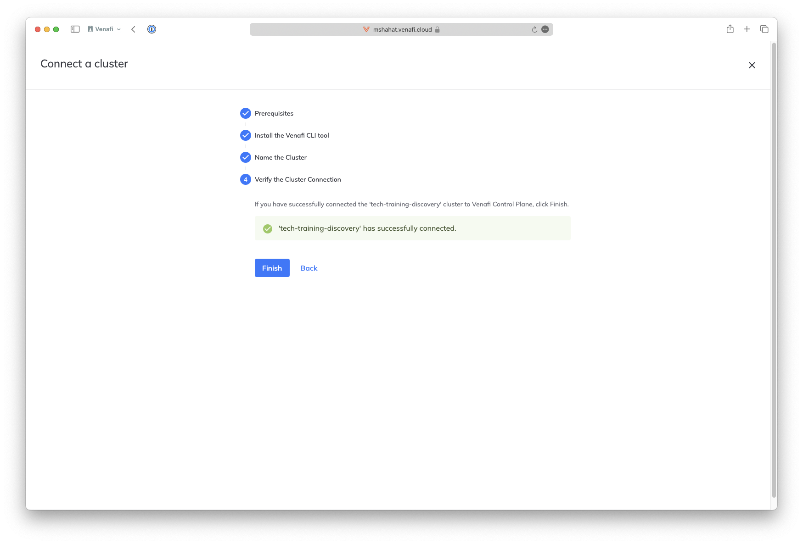
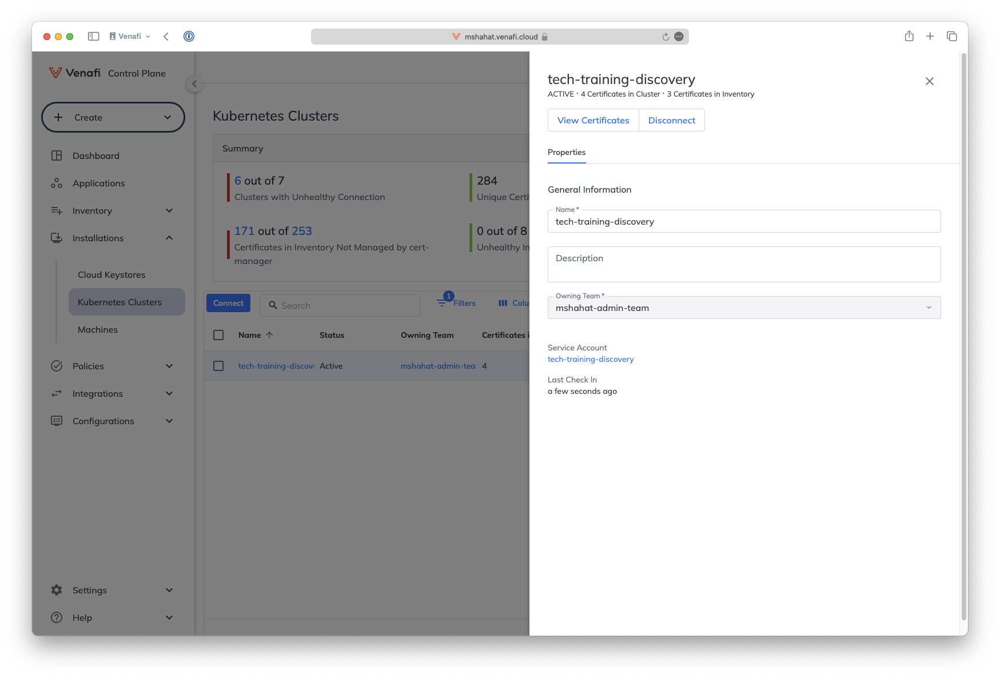

# Onboard a Kubernetes Cluster for Discovery

A key capability of TLS Protect for Kubernetes is the Disocvery of certificates in Kubernetes clusters

First you will seed some data into a cluster then you will onboard this cluster to VaaS for Discovery

If you don't have a Kubernetes cluster already, create one
- [Install Kind](README2.md#kind)
- [Create a Kubernetes cluster](README2.md#kubernetes-cluster)

## Seed data

```shell 
#Self signed cert
./venafi-install/sample-certificates/01.unmanaged-kid.sh

#Cert with long duration mounted on a pod
kubectl apply -f ./venafi-install/sample-certificates/02-expiry-eddie-cert.yaml
./venafi-install/sample-certificates/02.expiry-eddie.sh

#Cert with bad key size
./venafi-install/sample-certificates/03.cipher-snake.sh

#Orphan cert
kubectl apply -f venafi-install/sample-certificates/04-ghost-rider-cert.yaml

#phanton ca and cert
kubectl apply -f venafi-install/sample-certificates/cert-policy-and-rbac-self-signed.yaml 
kubectl apply -f venafi-install/sample-certificates/05-phantom-ca-cert.yaml
./venafi-install/sample-certificates/05.phantom-ca.sh
```


| Bandit           | Unmanaged    | Long Expiry | Weak Cipher | Non-Venafi | Unused    |
| ---------------- | ------------ | ----------- | ----------- | ---------- | --------- |
| 1) Lone Outlaw   | YES          | no          | no          | no         | no        |
| 2) Time Bandit   | no           | YES         | no          | no         | no        |
| 3) Cipher Snake  | no           | no          | YES         | no         | no        |
| 4) Ghost Rider   | no           | no          | no          | no         | YES       |
| 5) Phantom CA    | no           | no          | no          | YES        | no        |


## Onboard cluster to Venafi Control Plane

Go to Installations > Kubernetes Clusters > Connect

<p align="center">
  
</p>

Click Continue

<p align="center">
  
</p>

Copy the installation command to install `venctl`
If you have `venctl` installed already then skip this step 

<p align="center">
  
</p>

The installation script will guide you through the installation process

<p align="center">
  
</p>

Type in the Kubernetes cluster name as you would like it to show e.g. `tech-training-discovery`

Copy the connect commoand which will also include the api key ready to connect

<p align="center">
  
</p>

Run the connect command in a terminal after you have set the kubernetes context to the cluster you wish to connect to
if you have multiple contexts, you will be prompted to choose the one you would like to connect. You will also be prompted to choose which team 

if you don't have a team already created, please create one [Create a Team](README1.md#create-a-team)

<p align="center">
  
</p>

Go back to the Console, mark the check that the cluster is successfully connected then click Finish

<p align="center">
  
</p>

You should now see your cluster connect. Click *View Certificates* to view discovered certificates. It might take a few moments for more certificates to flow in

<p align="center">
  
</p>


[Main Menu](../README.md)